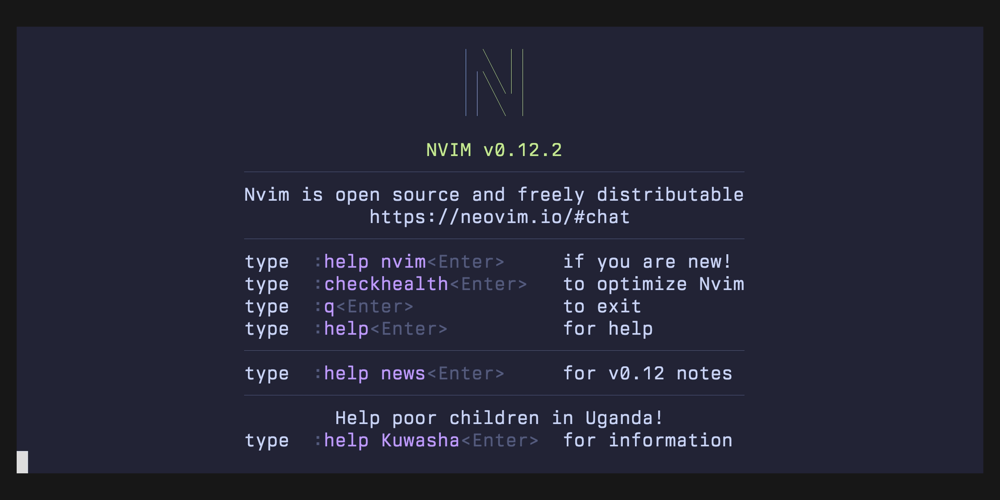
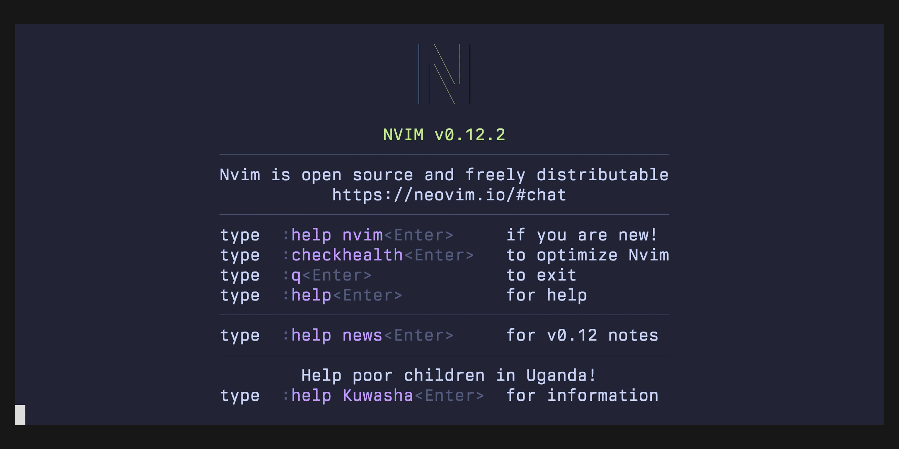
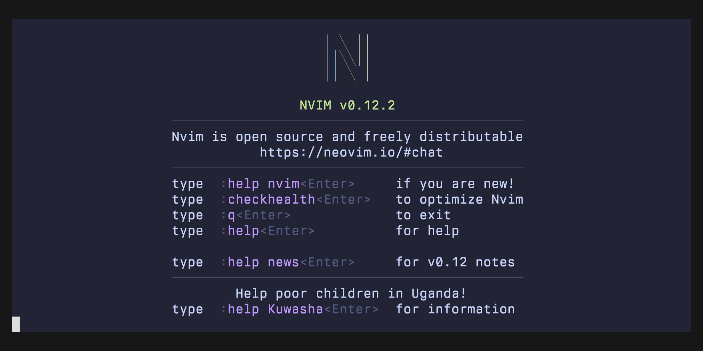
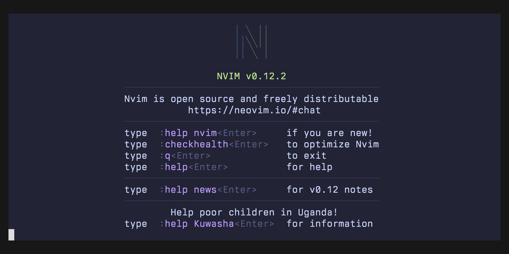

# Feature Demos

## Status Window

The status window shows information about your registered templates and stacks.
It'll show the registered artifact bucket, resources marked for import, and any loaded changesets.

Open the status window with `:Cfn status`, or map your own keybinding to open it.

## Registering Templates

You can register templates in your project to new or existing CloudFormation stacks, with an AWS CLI profile.
This template registration is used for other features, like ChangeSet creation and execution, or Stack Refactors.

## Resource Renaming

You can rename resources in your templates.
All references to that resource will be updated.
If the template has been deployed, the resource rename will be added to the stack refactor operation.

## Resource Import

You can import existing resources into your stack.
The resource import will be added to pending resource imports.
Pending resource imports will be added to the next ChangeSet that gets created.

## ChangeSet Creation

ChangeSets can be created with a form for parameters and tags.
When the ChangeSet is created, the actions will be rendered as highlighted annotations in the template.

## ChangeSet Execution

ChangeSets can also be executed.
As a ChangeSet is executed, actions are rendered as highlighted annotations in the template.

## StackRefactor Creation

This plugin lets you create StackRefactors, which enable you to move resources between stacks and change logical IDs.
Resource moves can be explicit via `:Cfn refactor move` or implicit across all stacks via `:Cfn refactor refresh`.
To add a stack to the current refactor operation, use `:Cfn refactor stack add`.

