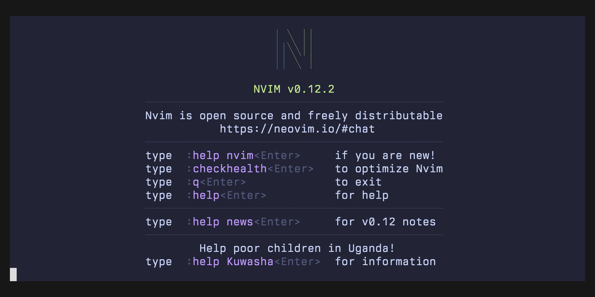

# cfn.nvim

Neovim plugin for working with AWS CloudFormation templates.



## Features

- Status Window: A live view into registered templates/stacks, imports, changesets, and refactors: `:Cfn status`
- Template Registration: Link a template to a profile/stack/region: `:Cfn template register`
- Resource Renaming: Rename a logical ID and update all references in the buffer: `:Cfn rename`
- Resource Import: Import a physical resource into the stack: `:Cfn import`
- ChangeSet Creation: Create a changeset with parameter/tag forms: `:Cfn changeset create`
- ChangeSet Execution: Execute a changeset and stream live resource deployment status: `:Cfn changeset execute`
- ChangeSet Opening: Open the changeset in the AWS Console: `:Cfn changeset open`
- Template Highlighting: Show imported resources, change set actions, and live status during stack operations.
- StackRefactor Moving: Move a resource from one logical ID in one stack to another: `:Cfn refactor move`
- StackRefactor Refresh: Infer moves by comparing the templates against the deployed stacks: `:Cfn refactor refresh`
- StackRefactor Creation: Create a new StackRefactor based on resource moves/renames: `:Cfn refactor create`
- StackRefactor Execution: Execute a StackRefactor and stream live resource deployment status: `:Cfn refactor execute`
- Parameter/Tag Hooks: Pre-populate parameter and tag forms with values returned from a lua function.

For demo gifs of these features, see [docs/demo/readme.md](./docs/demo/readme.md).

## Requirements

- Neovim 0.12+
- The CloudFormation language server
  - https://github.com/aws-cloudformation/cloudformation-languageserver
  - follow the instructions in that repo, you should have a `"cfn_lsp"` server configured

## Installation

With vim.pack:

```lua
vim.pack.add({
  { src = "https://github.com/mbarneyjr/cfn.nvim", version = vim.version.range("*") },
})
```

With lazy.nvim:

```lua
{ "mbarneyjr/cfn.nvim", version = "*" }
```

### Install from main

The plugin depends on a helper binary.
In a release install (`version = "*"`), the helper binary will be downloaded from GitHub releases.
For installs from main, you must build the binary instead with `go`.
Build it to `bin/cfn-nvim` inside the plugin directory, where the plugin looks for it.
No `setup()` change is needed.

With `vim.pack`, register this autocmd before `vim.pack.add()`:

```lua
vim.api.nvim_create_autocmd("PackChanged", {
  callback = function(ev)
    if ev.data.spec.name == "cfn.nvim" and ev.data.kind ~= "delete" then
      vim.system({ "go", "build", "-o", "bin/cfn-nvim", "." }, { cwd = ev.data.path })
    end
  end,
})
vim.pack.add({
  { src = "https://github.com/mbarneyjr/cfn.nvim", version = "main" },
})
```

With lazy.nvim:

```lua
{ "mbarneyjr/cfn.nvim", branch = "main", build = "go build -o bin/cfn-nvim ." }
```

### Nix

This flake outputs two packages: `vim-plugin` is the plugin, `cfn-nvim` is the helper binary.

```nix
{
  inputs.cfn-nvim.url = "github:mbarneyjr/cfn.nvim";
}
```

```nix
let
  cfn = inputs.cfn-nvim.packages.${pkgs.system};
in
{
  programs.neovim = {
    plugins = [ cfn.vim-plugin ];
    extraPackages = [ cfn.cfn-nvim ];
  };
}
```

`extraPackages` puts `cfn-nvim` on Neovim's `PATH`, so the plugin uses it and never downloads.

## Setup

```lua
require("cfn").setup()
```

With lazy.nvim, use `opts` instead.
lazy.nvim passes it to `require("cfn").setup()`:

```lua
{ "mbarneyjr/cfn.nvim", version = "*", opts = {} }
```

All options are optional and shown here with their defaults:

```lua
require("cfn").setup({
  lsp_client_name = "cfn_lsp",
  bin = {
    path = nil, -- override path to the cfn-nvim binary
  },
  status_window = {
    height = 15,
  },
  icons = {
    arrow_closed = "",
    arrow_open = "",
  },
  hooks = {
    -- hooks to pre-populate the parameter and tag forms at ChangeSet creation time
    parameters = nil, -- fun(ctx: cfn.HookContext): table<string, string>?
    tags = nil, -- fun(ctx: cfn.HookContext): table<string, string>?
  },
})
```

See [config.lua](./lua/cfn/lib/config.lua) for field-level documentation.

## Keymaps

This plugin comes with a status pane to render relevant information about the CloudFormation templates in your project.
You can register a keymap to open the status pane like so:

```lua
vim.keymap.set("n", "<leader>cs", require("cfn").fn.toggle_status_window, {
  desc = "cfn.nvim: rename resource",
})
```

The CloudFormation language server doesn't implement `textDocument/rename`.
This means `vim.lsp.buf.rename` won't do anything in a template buffer.
We recommend that you override your rename keymap to call `require("cfn").fn.rename_resource` instead.
This will handle renaming a resource within your template, making sure to update all references to that resource.
The following assumes you have `yaml.cloudformation`/`json.cloudformation` as registered filetypes for CloudFormation.

```lua
vim.api.nvim_create_autocmd("FileType", {
  pattern = { "yaml.cloudformation", "json.cloudformation" },
  callback = function(args)
    vim.keymap.set("n", "<leader>cr", require("cfn").fn.rename_resource, {
      buffer = args.buf,
      desc = "cfn.nvim: rename resource",
    })
  end,
})
```

## Parameter / Tag Form Hooks

You can define a lua function that gets called as a hook to retrieve parameter or tag values at ChangeSet creation time.

```lua
---@alias CfnHook fun(ctx: cfn.HookContext): table<string, string>? values keyed by name, used to pre-populate the form

require("cfn").setup({
  hooks = {
    ---@type CfnHook
    tags = function(ctx)
      return {
        key = "value",
        region = ctx.region,
        stack_name = ctx.stack_name,
        profile = ctx.profile,
        template_path = ctx.template_path,
      }
    end,
    ---@type CfnHook
    parameters = function(ctx)
      ...
      return { key = "value" }
    end,
  },
})
```

## Development

To test this plugin with a fresh Neovim install, you can use the sandbox Nix dev shells.
Each shell gives you a clean `nvim` and all of the tools the plugin needs.
Every shell installs the plugin with a different plugin manager or source:

- `nix develop .#sandbox-dev`: package the plugin with `vim.pack` from this repository, built from source
- `nix develop .#sandbox-live`: load the plugin straight off this working tree, no clone or commit needed
- `nix develop .#sandbox-release`: package the plugin with `vim.pack` from the newest release tag on GitHub
- `nix develop .#sandbox-lazy-dev`: package the plugin with `lazy.nvim` from this repository, built from source
- `nix develop .#sandbox-lazy-release`: package the plugin with `lazy.nvim` from the newest release tag on GitHub

In each shell `nvim` is a wrapper that points every XDG directory at that shell's own directory under `sandbox/`.
Your own Neovim config and state stay untouched, and no other program in the shell sees the redirect.
The shared editor config is in [`sandbox/common.lua`](./sandbox/common.lua).

The `dev`, `release`, and `lazy-*` sandbox shells install the plugin through a plugin manager.
They clone this repository and so does not see your uncommitted work.
The `live` shell instead prepends this repository to `runtimepath` directly, so Lua changes apply immediately on restart.
It rebuilds the Go CLI on every startup.

```sh
nix develop .#sandbox-dev
nvim template.yml
```
